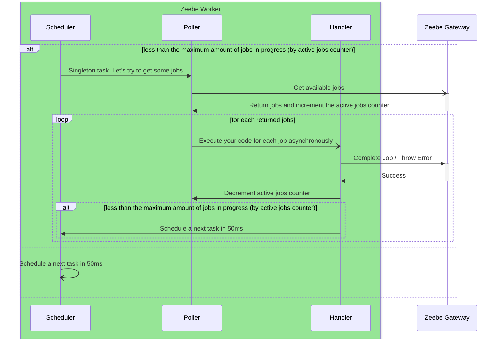

# Let's dig up in the client part

Again, we will focus on the JVM stack, and we are going to talk about the standard Zeebe Client Java worker.

I decided to split it into two logical parts:
- Creating processes, sending messages to resume your processes, and all non-worker parts
- Using workers to activate, execute some logic, and complete your jobs.

---
layout: center
---
# Creating processes
From: https://docs.camunda.io/docs/apis-tools/java-client-examples/process-instance-create/

Just use the `ZeebeClient`:
```java
final ProcessInstanceEvent processInstanceEvent =
        client
        .newCreateInstanceCommand()
        .bpmnProcessId(bpmnProcessId)
        .latestVersion()
        .send()
        .join();
```

---

# Workers
From: https://docs.camunda.io/docs/components/concepts/job-workers/#requesting-jobs


---

# Going deeper

<style>
div.mermaid {
    width: 70%;
}
</style>


