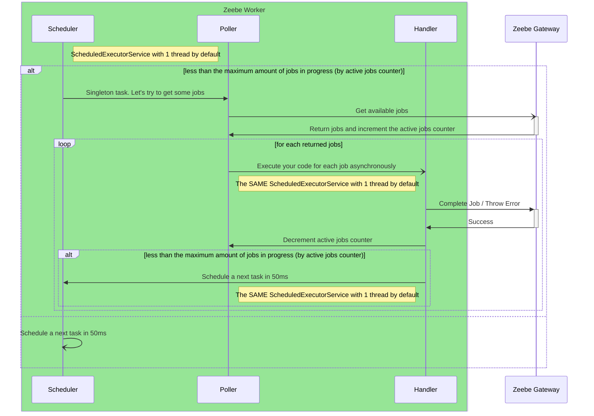
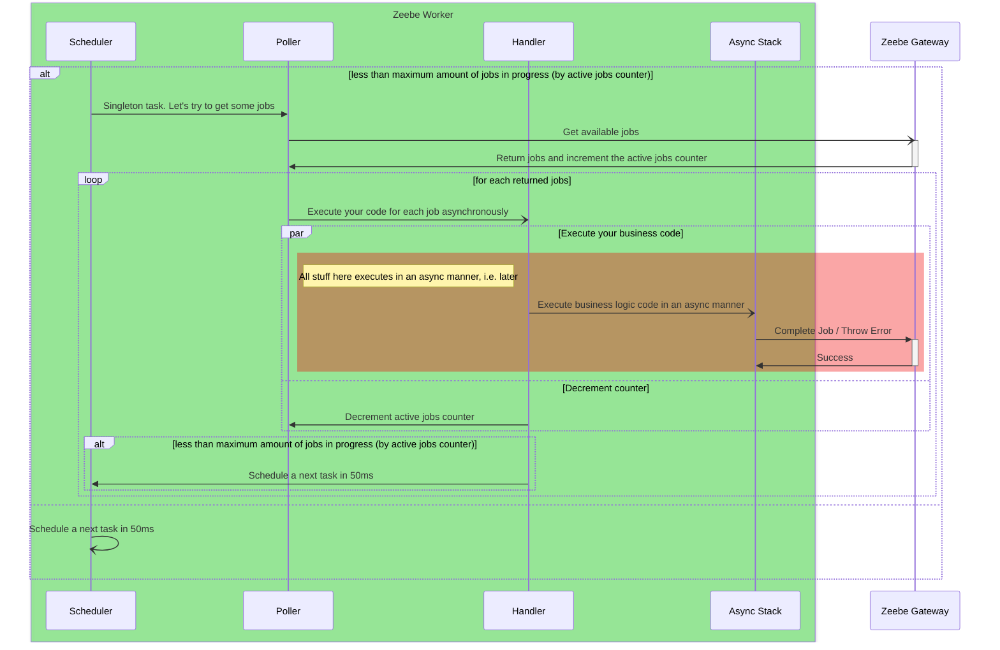

# Workers

---

# Rewind back to the architecture

<style>
div.mermaid {
    width: 70%; 
    height: auto;
}
</style>



---
layout: statement
---

# ScheduledExecutorService with one thread is the weakest spot in the workers
<br/>

P.S. This instance of `ScheduledExecutorService` is used in every worker that you have in the application if you are using Spring Zeebe.

---
layout: center
---
# So, how to fix it?

Two options:
1. Play with settings (thread pool size, more CPUs, fewer jobs to activate, more instances, etc.)
2. Embrace the asynchronous world

---
layout: center
---
# Let's try reactive

```kotlin {0|1-4|6-17|6|7|8-9|10|11-15|all}
@Component
class SomeWorkerService(
    private val someComponentWithSuspension: SomeComponentWithSuspension
) {

    @ZeebeWorker(type = "some")
    fun someJobWorker(job: ActivatedJob, jobClient: JobClient) {
        GlobalScope // we could use dedicated scope 
            .launch {
                val result = someComponentWithSuspension.callSuspendMethod(job.variables)
                jobClient
                    .newCompleteCommand(job)
                    .variables(result)
                    .send()
                    .await()
            }
    }
}
```

---
layout: center
---
# Results

1. It works fast because you aren't blocking threads
2. Requires fewer CPU cores (expensive) than the usual thread-blocking solution
3. As the tradeoff requires more memory than the original solution (asynchronous/reactive data structures for structured concurrency)
4. Blocking a thread makes performance worse.

---

# So, that's it?

A short answer is no :)

In some conditions you could get something like this:

<Transform scale="0.6">
    
</Transform>

---

# What's happening ?!

<style>
div.mermaid {
    width: 70%; 
    height: auto;
}
</style>

A short answer: limits for maximum jobs are not working



---
layout: statement
---

# Asynchronous execution without respecting limits could lead to the overflow problems

Also, unequal load balancing between instances.

---
layout: statement
---

# Coworker is the solution

---

# Coworker

1. Open Source Camunda Community project: https://github.com/camunda-community-hub/kotlin-coworker
2. Coroutine's native Scheduler, Poller, Handler
3. Supports users suspend methods out of box
4. Supports limit for maximum jobs (i.e. overflow problem never come, load spreads more or less equally between instances)
5. Supports different misc stuff (SPeL in the annotations, for example)
6. Supports and reuses Spring Zeebe's configuration, including properties

---

# How to get it?
<br>

Plain:

```xml
<dependency>
    <groupId>org.camunda.community.extension.kotlin.coworker</groupId>
    <artifactId>coworker-core</artifactId>
    <version>x.y.z</version>
</dependency>
```

Spring Boot Starter:

```xml
<dependency>
    <groupId>org.camunda.community.extension.kotlin.coworker</groupId>
    <artifactId>coworker-spring-boot-starter</artifactId>
    <version>x.y.z</version>
</dependency>
```

---
layout: two-cols
---

<style>
.slidev-code-wrapper {
    width: max-content; 
    height: max-content;
    transform-origin: top left;
    scale: 0.6;
}
</style>

# Spring Zeebe Worker

```kotlin {0|1-4|6|7|8-9|10-15|all}
@Component
class SomeWorkerService(
    private val someComponentWithSuspension: SomeComponentWithSuspension
) {

    @ZeebeWorker(type = "some")
    fun someJobWorker(job: ActivatedJob, jobClient: JobClient) {
        GlobalScope // we could use dedicated scope 
            .launch {
                val result = someComponentWithSuspension.callSuspendMethod(job.variables)
                jobClient
                    .newCompleteCommand(job)
                    .variables(result)
                    .send()
                    .await()
            }
    }
}
```

::right::

# Coworker

```kotlin {0|1-4|6|7|8-13|all}
@Component
class SomeWorkerService(
    private val someComponentWithSuspension: SomeComponentWithSuspension
) {
    
    @Coworker(type = "some")
    suspend fun someCoworker(job: ActivatedJob, jobClient: JobClient) {
        val result = someComponentWithSuspension.callSuspendMethod(job.variables)
        jobClient
            .newCompleteCommand(job)
            .variables(result)
            .send()
            .await()
    }
}
```
